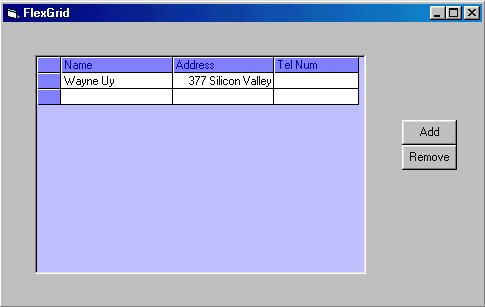



## Simple Flexgrid editing

### Description

Add editing capability for MSHflexgrid for the novice programmers, NO API calls just simple textbox position manipulation, very easy to understand, wish i had this when i was starting :)
 
### More Info
 
Knows how to add new components...

Nothing critical, just make sure form scale is in twips, not pixels so that text box will fit right in...

             |
---                |---
**Submitted On**   |2001-12-20 16:05:32
**By**             |[Wachuy](https://github.com/Planet-Source-Code/PSCIndex/blob/master/ByAuthor/wachuy.md)
**Level**          |Advanced
**User Rating**    |4.7 (33 globes from 7 users)
**Compatibility**  |VB 6\.0
**Category**       |[Complete Applications](https://github.com/Planet-Source-Code/PSCIndex/blob/master/ByCategory/complete-applications__1-27.md)
**World**          |[Visual Basic](https://github.com/Planet-Source-Code/PSCIndex/blob/master/ByWorld/visual-basic.md)
**Archive File**   |[Simple\_Fle4315012202001\.zip](https://github.com/Planet-Source-Code/wachuy-simple-flexgrid-editing__1-29973/archive/master.zip)

